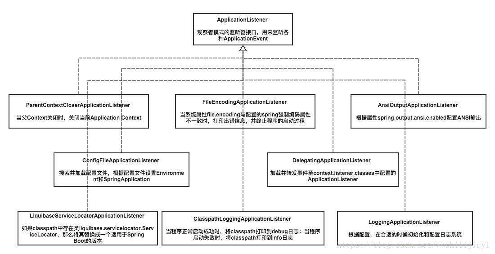

# SpringBoot 自动化装配
springBoot为我们提供了自动化装配的功能，简单方便。可以像使用插件一样，对各个组件自由组合装配。只需引入定义好的 starter 即可。有点类似于java的SPI机制，只不过SPI机制是为了解决项目与项目之间的解耦，而starter方式实现了模块化完全解耦，实现热插拔功能。
# SpringBoot 运行时监听器

# Spring Iot 解析过程
在spring ioc的过程中，优先解析@Component，@Service，@Controller注解的类。其次解析配置类，也就是@Configuration标注的类。最后开始解析配置类中定义的bean
> 实例代码：
```java
@Configuration
public class Configuration1 {

    @Bean
    @ConditionalOnBean(Bean2.class)
    public Bean1 bean1() {
        return new Bean1();
    }
}
@Configuration
public class Configuration2 {

    @Bean
    public Bean2 bean2(){
        return new Bean2();
    }
}
```
## 问题
示例代码中bean1是定义在配置类中的，当执行到配置类解析的时候，@Component，@Service，@Controller ,@Configuration标注的类已经全部被解析，所以这些BeanDifinition已经被同步。
但是bean1的条件注解依赖的是bean2，bean2是被定义的配置类中的，因为两个Bean都是配置类中Bean，所以此时配置类的解析无法保证先后顺序，就会出现不生效的情况。
同样的道理，如果依赖的是FeignClient，也有可能会出现不生效的情况。因为FeignClient最终还是由配置类触发，解析的先后顺序也不能保证。
## 解决
有两种方式：
* 项目中条件注解依赖的类，大多会交给spring容器管理，所以如果要在配置中Bean通过@ConditionalOnBean依赖配置中的Bean时，完全可以用@ConditionalOnClass(Bean2.class)来代替。
* 如果一定要区分两个配置类的先后顺序，可以将这两个类交与EnableAutoConfiguration管理和触发。也就是定义在META-INF\spring.factories中声明是配置类，然后通过@AutoConfigureBefore、AutoConfigureAfter、AutoConfigureOrder控制先后顺序。因为这三个注解只对自动配置类生效。
